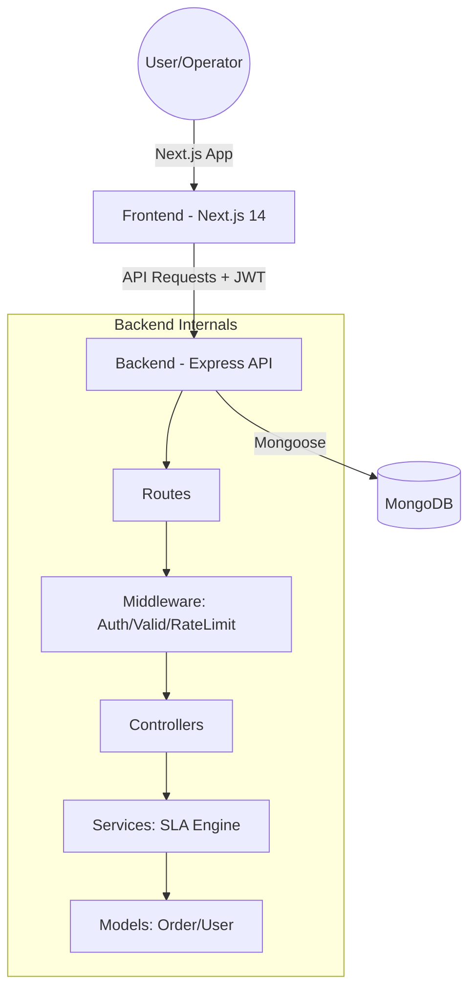

# 📦 ShipTrack — Shipment Tracking System (STS)
## Technical Documentation & System Architecture

> **Date:** May 1, 2026  
> **Version:** 1.0.0  
> **Author:** Senior System Architect  
> **Purpose:** Comprehensive technical breakdown for engineering and operations.

---

## 📘 1. PROJECT OVERVIEW

### What the system does
ShipTrack is a production-grade logistics monitoring platform designed to manage the "last-mile" delivery lifecycle. It provides real-time visibility into shipment statuses, automatically detects SLA (Service Level Agreement) breaches, and enables operations teams to document and analyze delay reasons.

### Business Problem
Logistics companies often suffer from "visibility gaps" where a package is "in transit" but the team doesn't know if it's on track to meet the customer's deadline. Late deliveries lead to customer dissatisfaction and contractual penalties.

### Why it matters
- **Proactive Intervention:** Identifies shipments likely to fail SLA *before* they actually breach.
- **Accountability:** Tracks exactly which agent handled a package and where it was at any given time via transit logs.
- **Root Cause Analysis:** Categorizes delays (Weather, Traffic, etc.) to help management identify systemic bottlenecks.

---

## 🧠 2. SYSTEM WORKFLOW (STEP-BY-STEP)

The system enforces a strict, one-directional status lifecycle:
`Created` → `Picked` → `In Transit` → `Delivered` OR `Failed`

1.  **Order Creation:** An operator creates an order with customer details and a **Promised Delivery Time**.
2.  **Agent Assignment (Picked):** When the warehouse staff marks an order as `Picked`, they **must** assign a `deliveryAgent`. This creates an accountability link.
3.  **Status Updates:** As the package moves, its status is updated to `In Transit`. Every update appends a new entry to the `transitLogs` (Audit Trail).
4.  **SLA Calculation:** The system constantly compares `now()` against `promisedDeliveryTime`.
    - If `now > deadline`, the order is flagged as **Delayed**.
    - If `deadline - now < 60 mins`, the order shows a **Warning**.
5.  **Delay Detection & Handling:** If an order is delayed, operators can record a `delayReason` and `delayNote` to explain the exception.
6.  **Completion:** The flow ends at `Delivered` (Success) or `Failed` (Exception). Terminal statuses stop SLA tracking.

---

## 🏗️ 3. ARCHITECTURE

### High-Level Overview
The system follows the **MERN** stack (MongoDB, Express, React/Next.js, Node.js) with a **Stateless JWT Authentication** model.



### Data Flow (Request → Response)
1.  **Request:** Client sends HTTP request with JWT in `Authorization` header.
2.  **Auth:** `protect` middleware verifies JWT and fetches User from DB.
3.  **Validation:** `validate` middleware checks request body against Joi schemas.
4.  **Logic:** Controller calls `slaService` or Mongoose methods to perform business logic.
5.  **Persistence:** Data saved to MongoDB.
6.  **Response:** Controller calls `serializeOrder` to compute **virtual SLA fields** (read-time calculation) and returns JSON.

---

## 🧱 4. TECH STACK (WITH JUSTIFICATION)

| Technology | Purpose | Justification |
| :--- | :--- | :--- |
| **Next.js 14 (App Router)** | Frontend Framework | Enables efficient routing, server-side rendering (SSR), and built-in SEO optimizations. |
| **Tailwind CSS** | Styling | Rapid UI development with a consistent design system and utility-first approach. |
| **Node.js & Express** | Backend Runtime | Non-blocking I/O ideal for handling multiple concurrent API requests in a logistics environment. |
| **MongoDB & Mongoose** | Database & ODM | Document-based storage allows flexible schemas (adding transit logs/notes) without complex migrations. |
| **JWT (jsonwebtoken)** | Authentication | Stateless auth allows the backend to scale horizontally without sharing session state. |
| **Joi** | Data Validation | Ensures data integrity at the API boundary, preventing "garbage in, garbage out." |
| **bcryptjs** | Security | Industry-standard salt/hashing for protecting user passwords. |

---

## 📁 5. FULL PROJECT STRUCTURE (CRITICAL)

### 📂 BACKEND ANALYSIS

#### `server.js`
- **Purpose:** Entry point for the API.
- **Logic:** Configures security headers (Helmet), CORS, JSON parsing, logging (Morgan), and rate limiting.
- **Connections:** Mounts routes and starts the MongoDB connection.

#### `config/`
- `db.js`: MongoDB connection logic with retry-on-failure.
- `env.js`: "Fail-fast" script that validates environment variables on startup.

#### `models/`
- `User.js`: Defines User roles (`admin`, `warehouse_staff`, `operations_manager`) and handles password hashing via `pre-save` hooks.
- `Order.js`: The core model. Features **virtual fields** for SLA (`isDelayed`, `delayDuration`) and an **auto-incrementing Order ID** (`STS-YYYYMMDD-XXXX`).

#### `controllers/`
- `authController.js`: Handles registration, login, and profile fetching. Blocks deactivated users from logging in.
- `orderController.js`: Contains CRUD logic. Crucially, it computes SLA data for *every* order returned to ensure accuracy.
- `userController.js`: Admin-only logic for listing, activating, and deactivating team members.

#### `services/`
- `slaService.js`: Pure functions that calculate if an order is delayed based on `promisedDeliveryTime`. Being "pure" makes this logic 100% testable without a DB.

#### `middleware/`
- `auth.js`: Verifies JWT and handles role-based access control (RBAC).
- `validate.js`: Generic Joi validator that intercepts bad requests before they hit controllers.
- `errorHandler.js`: Centralized error catching for database errors, 404s, and unexpected crashes.

---

### 📂 FRONTEND ANALYSIS

#### `app/` (Next.js App Router)
- `(auth)/`: Login and Signup pages.
- `dashboard/`: The main command center showing stats and the active order table.
- `orders/[id]/`: Detailed view of a single order including the **Transit Timeline**.

#### `components/`
- `ui/`: Reusable primitives (Buttons, Inputs, Cards, StatusBadges).
- `dashboard/`: Stats cards and filterable data tables.
- `layout/`: `AppShell.tsx` provides the navigation sidebar and layout wrapping.

#### `hooks/`
- `useAuth.ts`: Manages global user state, persistent login, and redirection.
- `useOrders.ts`: Handles fetching order lists with **30-second auto-refresh** for real-time monitoring.

#### `services/api/`
- `client.ts`: Axios configuration with an **interceptor** that injects the JWT and handles `401 Unauthorized` logouts.
- `orders.ts`: Typed API definitions for all order-related operations.
- `users.ts`: API service for admin-only user management actions.

---

## 🔄 6. DATA FLOW EXPLANATION

### UI → Backend → DB → UI (Order Update Example)
1.  **UI:** User clicks "Mark as Picked" and enters agent info.
2.  **Service:** `ordersApi.update(id, { status: 'Picked', agent: ... })` is called.
3.  **API:** Express receives request, `protect` middleware verifies user.
4.  **Logic:** `orderController.updateOrder` checks if `Picked` is a valid next step from `Created`.
5.  **Audit:** A new entry is pushed to `transitLogs` with the current timestamp and operator ID.
6.  **DB:** `Order.save()` persists the change.
7.  **SLA:** The controller serializes the response. `slaService` checks if it's currently delayed.
8.  **UI:** Frontend receives the updated JSON, state updates, and the Status Badge changes color instantly.

---

## 🗄️ 7. DATABASE EXPLANATION

### Order Schema
| Field | Type | Description |
| :--- | :--- | :--- |
| `orderId` | String | Unique human-readable ID (Index). |
| `status` | Enum | Current stage of the lifecycle. |
| `promisedDeliveryTime` | Date | The deadline (Index). |
| `transitLogs` | Array | History of status changes (Audit trail). |
| `deliveryAgent` | Object | ID, Name, Phone of the assigned driver. |
| `delayReason` | Enum | Why the breach happened (Traffic, Weather, etc.). |

### User Schema
| Field | Type | Description |
| :--- | :--- | :--- |
| `email` | String | Unique login identifier. |
| `role` | Enum | `admin` \| `operations_manager` \| `warehouse_staff`. |
| `passwordHash` | String | Bcrypt-protected secret (Selected: false). |
| `isActive` | Boolean | Account status (Soft delete mechanism). |

### 🛠️ How to access Database
- **Connection String:** `mongodb://localhost:27017/shipment_tracker`
- **Tool:** Use **MongoDB Compass** for visual debugging.
- **Indexing:** We use a compound index on `{ status: 1, promisedDeliveryTime: 1 }` to make "Show all delayed orders" extremely fast even with millions of records.

---

## 🔐 8. ROLE-BASED ACCESS CONTROL (RBAC)

ShipTrack implements a granular RBAC system to ensure data integrity and security.

### 1. Permissions Matrix
| Action | Warehouse Staff | Operations Manager | Admin |
| :--- | :---: | :---: | :---: |
| View Stats | ✅ | ✅ | ✅ |
| Update Order | ✅ | ✅ | ✅ |
| Create Order | ❌ | ✅ | ✅ |
| Manage Users | ❌ | ❌ | ✅ |

### 2. Implementation Details
- **Route Protection:** Handled via the `authorise(...roles)` middleware.
- **Auth Guard:** The `protect` middleware checks the `isActive` flag on every request. If an admin deactivates a user, their token immediately becomes invalid for the next request.
- **Self-Destruct Prevention:** Admins cannot deactivate their own accounts or remove the last administrator from the system.

---

## 📊 9. DASHBOARD LOGIC

### KPI Computation
Instead of fetching all orders, the backend uses **MongoDB Aggregation**:
- `total`: `countDocuments({})`
- `delivered`: `countDocuments({ status: 'Delivered' })`
- `delayed`: `countDocuments({ status: { $nin: ['Delivered', 'Failed'] }, promisedDeliveryTime: { $lt: now } })`

### Delayed Order Filtering
The dashboard table defaults to "All". When "Show Delayed" is toggled, it calls the API with `?delayed=true`. The backend applies the logic: *Status is not terminal AND deadline has passed.*

---

## ⚠️ 10. SLA + DELAY LOGIC

### Calculation Engine (`slaService.js`)
The logic is **dynamic** and computed on the fly:
```javascript
// Pseudo-code logic
const isDelayed = status !== 'Delivered' && now > promisedDeliveryTime;
const delayDuration = now - promisedDeliveryTime;
```
**Edge Cases Handled:**
- **Terminal Status:** Once delivered or failed, SLA breaches are no longer calculated.
- **Warning Window:** Orders due in < 1 hour show a yellow "Warning" badge.
- **Negative Durations:** If an order is early, `delayDuration` is `null`.

---

## 🎨 11. UI/UX DECISIONS

- **Premium Dark UI:** Uses a professional palette to reduce eye strain for operators working long shifts.
- **Color Coding:** 
    - 🔵 `Blue`: Normal
    - 🟡 `Yellow`: Warning (SLA near)
    - 🔴 `Red`: Breach (SLA passed)
    - 🟢 `Green`: Success
- **Sticky Headers:** Order table headers remain visible when scrolling through large lists.
- **Row Navigation:** Clicking any row in the table navigates to the detailed timeline view.

---

## 🧪 12. TESTING + EDGE CASES

- **Unauthorized Access:** Middleware prevents any order updates without a valid JWT.
- **Invalid Transitions:** An order cannot move from `Delivered` back to `Picked`. The `Order.js` static method blocks this.
- **Missing Agent:** The API returns `400 Bad Request` if an operator tries to move an order to `Picked` without providing agent details.

---

## 🔒 13. SECURITY

- **Password Hashing:** `bcryptjs` with 12 rounds of salting.
- **JWT Expiry:** Tokens expire in 7 days to limit risk if a token is stolen.
- **Input Sanitization:** Joi strips any fields from the request that are not explicitly defined in the schema.
- **Rate Limiting:** Prevents brute-force login attempts (100 requests per 15 mins).

---

## ⚡ 14. PERFORMANCE + SCALING

- **Database Indexing:** All queries used by the dashboard are backed by MongoDB indexes.
- **Statelessness:** The API can be cloned across multiple servers (load balanced) because it doesn't store session data.
- **Auto-Refresh:** Frontend uses a smart 30s polling window instead of aggressive 1s updates to save battery and bandwidth.

---

## 🚀 15. DEPLOYMENT

- **Backend:** Hosted on **Render** (Node.js Web Service).
- **Frontend:** Hosted on **Vercel** (Next.js Framework).
- **Database:** **MongoDB Atlas** (Cloud Managed Cluster).
- **CI/CD:** Automatic deployment on every `git push` to the main branch.

---

## 🔮 16. FUTURE IMPROVEMENTS

- **Real-time WebSockets:** Replace 30s polling with Socket.io for instant updates.
- **SMS Notifications:** Send automated SMS to customers when a shipment is marked as `In Transit`.
- **Photo Proof:** Allow agents to upload a photo of the delivered package.
- **GPS Integration:** Track agent location in real-time on a map.

---

## 🔄 17. AUTO-UPDATE STRATEGY

To keep this documentation from becoming "stale":
1.  **Single Source of Truth:** This Markdown file is the master reference.
2.  **Code Comments:** Use **JSDoc** for every new function.
3.  **Triggers for Documentation Update:**
    - Change in `Order.js` schema.
    - New API endpoint added to `routes/`.
    - Modification of the SLA warning threshold.
    - Change in the status lifecycle flow.

---

**End of Technical Documentation.**
