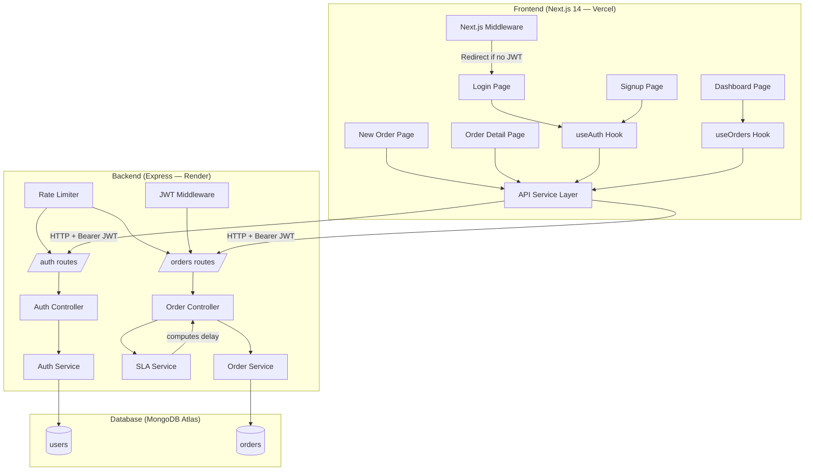

# Design Document — Shipment Tracking System (STS)
**Version:** 1.0  
**Date:** April 2026

---

## 1. High-Level Architecture

The system follows a classic **three-tier architecture** with a clear separation between presentation, business logic, and persistence. This makes it easy to scale each layer independently.

```
┌─────────────────────────────────────────────────────────────┐
│                        CLIENT LAYER                         │
│   Next.js 14 (App Router) — Vercel CDN                     │
│   Tailwind CSS, Axios, React Hooks                          │
└────────────────────────┬────────────────────────────────────┘
                         │ HTTPS / REST JSON
┌────────────────────────▼────────────────────────────────────┐
│                        API LAYER                            │
│   Node.js + Express — Render / Railway                      │
│   JWT Auth · Rate Limiting · Joi Validation                 │
│   Routes → Controllers → Services                           │
└────────────────────────┬────────────────────────────────────┘
                         │ Mongoose ODM
┌────────────────────────▼────────────────────────────────────┐
│                      DATA LAYER                             │
│   MongoDB (Atlas or local)                                  │
│   Collections: users, orders                                │
└─────────────────────────────────────────────────────────────┘
```

---

## 2. Architecture Diagram (Mermaid)



---

## 3. API Design

### Base URL
```
Development:  http://localhost:5000/api
Production:   https://sts-api.onrender.com/api
```

### Authentication Routes

#### `POST /api/auth/register`
Register a new user.

**Request:**
```json
{
  "name": "Sarah Chen",
  "email": "sarah@logisticsco.com",
  "password": "SecurePass123!",
  "role": "operations_manager"
}
```

**Response `201`:**
```json
{
  "success": true,
  "token": "eyJhbGciOiJIUzI1NiIsInR5cCI6IkpXVCJ9...",
  "user": {
    "id": "664a2f...",
    "name": "Sarah Chen",
    "email": "sarah@logisticsco.com",
    "role": "operations_manager"
  }
}
```

**Error `400`:**
```json
{
  "success": false,
  "error": "Email already registered"
}
```

---

#### `POST /api/auth/login`
Authenticate and receive JWT.

**Request:**
```json
{
  "email": "sarah@logisticsco.com",
  "password": "SecurePass123!"
}
```

**Response `200`:**
```json
{
  "success": true,
  "token": "eyJhbGciOiJIUzI1NiIsInR5cCI6IkpXVCJ9...",
  "user": { "id": "...", "name": "Sarah Chen", "role": "operations_manager" }
}
```

---

#### `GET /api/auth/me`
Get current authenticated user. Requires `Authorization: Bearer <token>`.

**Response `200`:**
```json
{
  "success": true,
  "user": { "id": "...", "name": "Sarah Chen", "email": "...", "role": "..." }
}
```

---

### Order Routes (all require Bearer JWT)

#### `POST /api/orders`
Create a new order.

**Request:**
```json
{
  "customerName": "Acme Corp",
  "promisedDeliveryTime": "2026-04-30T18:00:00.000Z",
  "notes": "Fragile — handle with care"
}
```

**Response `201`:**
```json
{
  "success": true,
  "order": {
    "orderId": "STS-20260430-0042",
    "customerName": "Acme Corp",
    "status": "Created",
    "promisedDeliveryTime": "2026-04-30T18:00:00.000Z",
    "isDelayed": false,
    "delayDuration": null,
    "createdAt": "2026-04-29T12:00:00.000Z"
  }
}
```

---

#### `GET /api/orders`
List all orders with optional filters.

**Query Params:**
| Param | Type | Example |
|---|---|---|
| `status` | string | `?status=In+Transit` |
| `delayed` | boolean | `?delayed=true` |
| `page` | number | `?page=2` |
| `limit` | number | `?limit=20` |

**Response `200`:**
```json
{
  "success": true,
  "count": 42,
  "page": 1,
  "totalPages": 3,
  "orders": [
    {
      "orderId": "STS-20260430-0042",
      "customerName": "Acme Corp",
      "status": "In Transit",
      "promisedDeliveryTime": "2026-04-29T10:00:00.000Z",
      "isDelayed": true,
      "delayDuration": "3h 22m",
      "createdAt": "2026-04-28T08:00:00.000Z",
      "updatedAt": "2026-04-29T09:15:00.000Z"
    }
  ]
}
```

---

#### `GET /api/orders/stats`
Dashboard KPI counts.

**Response `200`:**
```json
{
  "success": true,
  "stats": {
    "total": 87,
    "delivered": 54,
    "inTransit": 18,
    "delayed": 11,
    "failed": 4
  }
}
```

---

#### `GET /api/orders/:id`
Single order detail.

---

#### `PATCH /api/orders/:id`
Update order status.

**Request:**
```json
{
  "status": "Delivered"
}
```

**Business Rule:** Status can only move forward. Attempting `Delivered → In Transit` returns `400 Bad Request`.

---

## 4. Database Schema

### Collection: `users`

```
{
  _id:          ObjectId (auto)
  name:         String, required, maxLen 100
  email:        String, required, unique, lowercase
  passwordHash: String, required (bcrypt, never returned in responses)
  role:         Enum ["admin", "operations_manager", "warehouse_staff"]
                default "warehouse_staff"
  createdAt:    Date (auto)
  updatedAt:    Date (auto)
}
```

### Collection: `orders`

```
{
  _id:                  ObjectId (auto)
  orderId:              String, unique, indexed
                        Format: STS-YYYYMMDD-XXXX (e.g. STS-20260429-0001)
  customerName:         String, required, maxLen 150
  status:               Enum ["Created","Picked","In Transit","Delivered","Failed"]
                        default "Created"
  promisedDeliveryTime: Date, required
  notes:                String, optional, maxLen 500
  createdBy:            ObjectId → ref users
  createdAt:            Date (auto)
  updatedAt:            Date (auto)

  // Virtual fields (computed at query time, NOT stored):
  isDelayed:            Boolean — true if currentTime > promisedDeliveryTime
                                  AND status NOT IN ["Delivered", "Failed"]
  delayDuration:        String  — "2h 15m" or null
  timeUntilDue:         String  — "Due in 45m" or null
}
```

### Indexes
```
users:  email (unique)
orders: orderId (unique), status, promisedDeliveryTime, createdAt
        Compound: { status: 1, promisedDeliveryTime: 1 }  ← powers delayed filter
```

---

## 5. SLA Breach Logic

This is the core business logic of the system. It runs **every time an order is returned from the API** — no cron job, no stored flag.

```
function computeSLAStatus(order, now = new Date()):

  # Terminal statuses — SLA is irrelevant
  if order.status in ["Delivered", "Failed"]:
    return { isDelayed: false, delayDuration: null, timeUntilDue: null }

  deadline = order.promisedDeliveryTime

  # CASE 1: Currently delayed
  if now > deadline:
    diffMs    = now - deadline
    hours     = floor(diffMs / 3600000)
    minutes   = floor((diffMs % 3600000) / 60000)
    return {
      isDelayed: true,
      delayDuration: "${hours}h ${minutes}m",
      timeUntilDue: null
    }

  # CASE 2: Due soon (within 60 minutes)
  remainingMs = deadline - now
  if remainingMs <= 3600000:
    minutes = ceil(remainingMs / 60000)
    return {
      isDelayed: false,
      delayDuration: null,
      timeUntilDue: "Due in ${minutes}m"
    }

  # CASE 3: On track with time to spare
  return { isDelayed: false, delayDuration: null, timeUntilDue: null }
```

**Why not store `isDelayed` in MongoDB?**  
Storing it would require a background job to continuously update it. Computing it at read time means the data is always accurate, with zero additional infrastructure. At scale (100k+ orders), a compound index on `{status, promisedDeliveryTime}` makes the delayed query extremely fast.

---

## 6. Authentication Flow

```
┌──────────┐     POST /auth/login          ┌──────────────┐
│  Client  │  ─────────────────────────►  │   Backend    │
│          │  { email, password }          │              │
│          │                              │  1. Find user │
│          │                              │  2. bcrypt    │
│          │                              │     compare   │
│          │  ◄─────────────────────────  │  3. Sign JWT  │
│          │  { token, user }             │     (7d exp)  │
│          │                              └──────────────┘
│  Stores  │
│  token   │
│  in      │
│  memory  │
│  +       │
│  cookie  │
└──────────┘

  Next Request:
  Authorization: Bearer eyJhbGci...
        │
        ▼
  [JWT Middleware]
  - Verify signature
  - Check expiry
  - Attach req.user = { id, role }
        │
        ▼
  [Controller] — proceeds with req.user available
```

**Token Lifecycle:**
- Issued with 7-day expiry
- Stored in `localStorage` on client + passed as `Authorization: Bearer` header
- No refresh token in v1 (added in v2 roadmap)
- Logout = client deletes token; no server-side blacklist needed at this scale

---

## 7. Key Trade-Offs

| Decision | Trade-Off | Rationale |
|---|---|---|
| Monolith over microservices | Less isolation, but far less ops overhead | Right for v1 scale; refactor when team/traffic demands it |
| Compute SLA at read time vs. store flag | Slightly more CPU per request, zero stale data | SLA accuracy is non-negotiable for this domain |
| MongoDB over PostgreSQL | Less relational integrity, but flexible schema | Order schema evolves in early product; joins not needed |
| JWT (stateless) vs sessions | Can't revoke tokens instantly, but scales to multi-instance without sticky sessions | Logistics API doesn't require immediate token revocation |
| Next.js App Router vs Pages Router | More complex mental model, but better for future RSC adoption | Future-proof, better DX for dashboard-heavy apps |

---

## 8. Error Handling Strategy

### Backend: Centralised Error Handler

All errors flow through a single `errorHandler` middleware. Controllers never write `res.status().json()` for errors — they throw and let the handler respond.

```
HTTP 400 — Validation Error (Joi)
  { "success": false, "error": "promisedDeliveryTime is required", "field": "promisedDeliveryTime" }

HTTP 401 — Authentication Error
  { "success": false, "error": "Invalid or expired token" }

HTTP 403 — Authorisation Error
  { "success": false, "error": "Insufficient permissions" }

HTTP 404 — Not Found
  { "success": false, "error": "Order not found" }

HTTP 409 — Conflict
  { "success": false, "error": "Email already registered" }

HTTP 429 — Rate Limited
  { "success": false, "error": "Too many requests, please try again later" }

HTTP 500 — Internal Server Error
  { "success": false, "error": "Internal server error" }
  (stack trace logged server-side only, never exposed to client)
```

### Frontend: Error Boundaries + Axios Interceptors

- Axios response interceptor catches `401` globally → clears token → redirects to `/login`
- Form-level errors shown inline using React state
- Toast notifications for network-level failures
